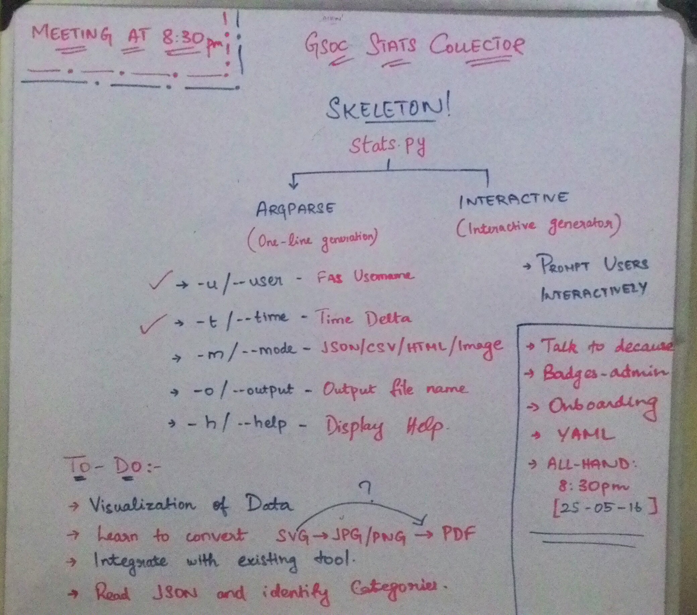

Tags: fedora,gsoc
Title: [GSoC '16] Let the Coding Begin!
Date: 2016-05-25 17:57:51
Slug: gsoc-16-let-the-coding-begin
Category: gsoc
Cover: https://communityblog.fedoraproject.org/wp-content/uploads/2016/03/gsoc-announce-1.png

The coding period of [GSoC](http://summerofcode.withgoogle.com) has finally started. It started on 23rd of May, but to me, it just started today as I had taken a 2 day excuse (Exams, sigh). As I mentioned in my earlier post, I will be working with the Fedora Project to build metrics tools in Python and also will also be helping the Commops team in refining the Fedora Onboarding process.

My internship this summer will be mostly, Python centric and will involve a lot of scraping, automation, analytics and data crunching. I am currently working on a [gsoc-statistics](https://pagure.io/gsoc-stats) tool for Fedora which will auto-magically generate weekly reports given a fedora FAS username. Instead of pushing code to Github, which I do; quite often, I have decided to work with Pagure, Fedora's own repository tracker. There's a GSoC project to improve [Pagure](http://pagure.io) as well ;)

To start off with the work, I decided to draw a rough skeleton of what I'd like the stats-tool to look like. I usually plan everything on paper, but since I'm home, I had the luxury of using the whiteboard. Here's what my whiteboard looks like now :

This is just the beginning, and I'm excited already. Hoping to have a great summer this year :)

Oh, and if you are a FOSS enthusiast and would like to start contributing to Fedora, do take a look at [WhatCanIDoForFedora](http://whatcanidoforfedora.org). If you have any other Fedora related questions, feel free to ping me on IRC / e-mail. I go by the nick `skamath` on Freenode. You can find me in the `#fedora-commops` channel.
