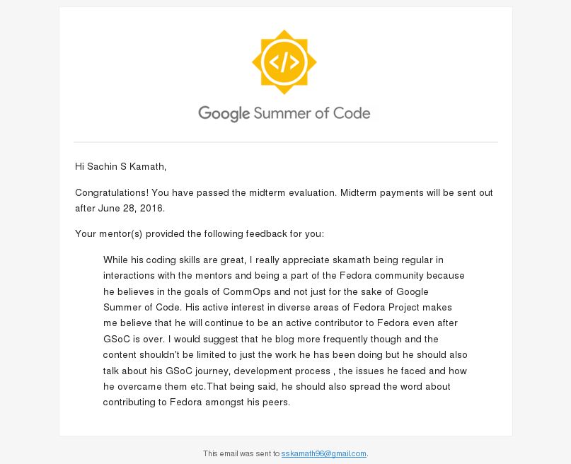
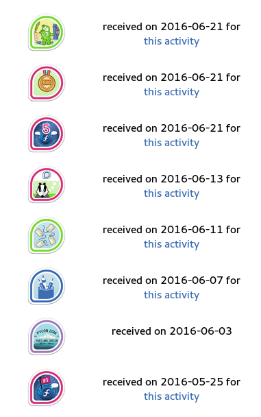

Tags: fedora,gsoc,foss,design
Title: GSoC - Journey So Far ( Badges, Milestones and more..)
Date: 2016-06-29 07:37:17
Slug: gsoc-journey-so-far-badges-milestones-and-more
Cover: https://communityblog.fedoraproject.org/wp-content/uploads/2016/03/gsoc-announce-1.png
Category: gsoc

2 days ago, I woke up to a mail from Google saying that I passed the mid term evaluations of GSoC and could continue working towards my final evaluation. *"What a wonderful way to kick start a day, I thought"*.

*Image : E-mail from Google Summer of Code*

Working on the statistics tool was an amazing experience. You can browse my previous posts for a very detailed idea of what I've been working on. Apart from all the code written, I also got an opportunity to communicate with a lot of amazing people who are part of the Fedora Community as well get bootstrapped to the fedora-infrastructure team *(and got an awesome [badge](https://badges.fedoraproject.org/badge/no-longer-a-ronin) for it)*

Getting sponsored to the fi-apprentice group allows one to access the Fedora Infrastructure machines and setup in read only mode *(via SSH)* and understand how things are done. However, write access is only given to those in the sysadmin group, who are generally the l33t people in `#fedora-admin` on Freenode ;)

Apart from that, I got the opportunity to attend a lot of CommOps Hack sessions and IRC Meetings where we discussed and tackled various pending tickets from the CommOps Trac. We are currently working on Onboarding Badges Series for various Fedora groups. Onboarding badges are generally awarded to all those who complete a set of specific tasks (pre-requisites) and get sponsored into the respective Fedora group. One such badge is to be born very soon - take a look at the CommOps Onboarding ticket [here](https://fedorahosted.org/fedora-badges/ticket/464).

**Life-Cycle of a badge :**

Getting a new badge ready is not a very easy task. A badge is born when someone files a badge idea in the Fedora Badges [Trac](https://fedorahosted.org/design-team/). The person who files a ticket is expected to describe the badge as accurately as possible - including the description, name and particulars. After that is done, a person needs to triage the badge and suggest changes to it (if required). The triager is also expected to fill in additional details about the badge so that the `YAML` can be made to automate the badge awarding process. The next step is to write yaml definitions for the badge and attach initial concept artwork of the badge. This is reviewed by the `fedora-design` team and is either approved or further hacked upon.After the approval, the badge is all set to be shipped. QR codes might be printed to manually award the badge, especially when it is an event badge.

Having talked about the badges, I was awarded the following badges during my GSoC Period :

 *Image : Coding period badges (and counting ..)* 

Badges are a great way to track your progress in the community. It is also super-useful for the new-contributors as they can work keeping the badges as goals. Read bee's blog post about it [here](https://networksfordata.wordpress.com/2015/10/19/fedorabadges/).

To keep a check on myself, I have compiled all my data over [here](https://github.com/sachinkamath/fedstats-data/tree/master/interns-mid-term/skamath). This repo has all the things I have done inside the community and also has SVG graphs that holds the metrics of it. Hoping to have a great summer ahead.

**Useful Links for new contributors :**

* WhatCanIDoForFedora - http://whatcanidoforfedora.org/
* Fedora Join - https://fedoraproject.org/wiki/Join
* CommOps Onboarding - https://fedoraproject.org/wiki/CommOps/Join
* Freenode - http://webchat.freenode.net/?channels=#fedora-join  

You can also find me hanging out in `#fedora-commops` on Freenode. Feel free to drop-in and say hello :)
