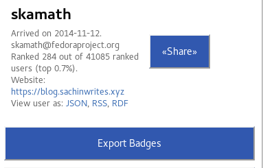
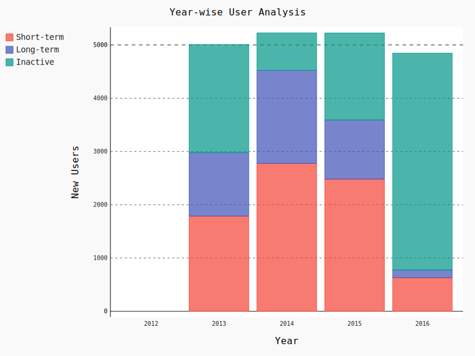

Tags: fedora,gsoc,python
Title: Identifying Fedora Contributors - Stats for Flock
Date: 2016-08-06 13:06:00
Slug: identifying-fedora-contributors-stats-for-flock
Cover: https://communityblog.fedoraproject.org/wp-content/uploads/2016/03/gsoc-announce-1.png
Category: gsoc

Quoting the Fedora Wiki :

>Flock is an annual conference for Fedora contributors to come together, discuss new ideas, work to make those ideas a reality, and continue to promote the core values of the Fedora Community: Freedom, Friends, Features, and First.

I was working on generating statistics for Flock this week. Bhagyashree (bee2502), my GSoC mentor,  had delivered a [talk](http://sched.co/76oD) on Fedora Contributors and Newcomers Onboarding and I was assigned the task of generating statistics of the whole Fedora Community. At first thought, this was a pretty hectic thing to do. To accomplish this, I will need data of all the contributors from the beginning of fedmsg -i.e from 2012. And, I will have to find when a user had signed up for a FAS account and track his/her activity. *Phew!*

Now let's crunch the numbers :

**Estimating Users :**

It was pretty simple, the Fedora Badges front-end (Tahrir) suggested that there were around 41,000 FAS Accounts which fedmsg was tracking and had logged into the badges website. I assumed that if an account was to be of a contributor, he/she should have logged into the badges system. Okay, so I have the count, what now?

**Making sense out of the mess :**

I fired up my tool and added an extra element to it, i.e : the topic field of the requests (as `org.fedoraproject.prod.fas.user.create`) and set the `--start` and `--end` to match the starting and ending date of every year.

In simple terms, I am pulling the usernames of all those people who made their FAS account in between the years 201**x** - 201**(x+1)** (from 2012 to 2016), one year at a time. This will give me the total count of FAS accounts made every year. I could have just taken the `count` value from the JSON for this, but I needed the usernames for later. Along with this, I also dumped the usernames into a file in the format `{username : timestamp_of_creation}` into a file.

It looked something like [this](https://github.com/sachinkamath/fedora-flock/blob/master/dumps/2012.json). I did this for all the years until I had `2012.json` to `2016.json`.

This gave me the count of FAS accounts being made every year - and with some pygal magic, I got this :

*Right click and select View Image for an interactive graph*

**Pull, pull, pull :**

Now that we have the usernames and the timestamp of creation, we can check if the user was active for a certain period or not. I did this by pulling the data of a user with the `--start` and the `--end` arguments in 3 different ways.

1) Check if the user was active immediately, for that - the `--start` was set as **`T1` = (time of account creation)** and end was set as **`T2` = (time of account creation + timedelta of 2 weeks)**.

If the user had `count > 10`, then the user was checked if the user was active between **`T2`** and **`T2 + time delta of one month`**. If the user did not have any, a variable called `slow_start` was set to True for that user and was subsequently checked for 6+ months activity. Why? Because, there are a lot of people who created a FAS account early and started contributing after an year or so. Again, if `count` was less than 0, then the user was marked inactive.  If the user had activity during this period, he/she was marked as a slow starter. And this is what I got after running the script :

**Identifying long-term and short-term contributors :**

The following set of rules were set followed for differentiating users :

*Users considered inactive :*

1) Users who have less than 10 fedmsg activity count
2) Users who have only created FAS
3) Users who made very few wiki edits + created a FAS account
4) `not_category` was set as fedbadges for such messages - so that the fedmsg activity won't exceed 10.

*Users considered short term :*

1) Users who have activity < 3 months.
2) People who have considerable amount of fedmsg activity and don't have any activity after a month.
3) `not_category` is again set as fedbadges here.

*Users considered long term:*

1) Users who have 3+ months of activity
2) Even if a user hasn't contributed in 6 months after creating the FAS account and then has considerable amount of fedmsg activity after another 6 months or an year.
3) Don't call it a comeback badge is considered https://badges.fedoraproject.org/badge/dont-call-it-a-comeback

After running this, I ended up with the following graph:

*Right click and select View Image for an interactive graph*

All this ended up in Flock in the form of a [presentation](https://docs.google.com/presentation/d/1ANub0RZtqnLaBDzpiQRUkZdnf7n75Pn9H16gb0wZg68/) and not to mention, had a good sleep after crunching up the stats :)
