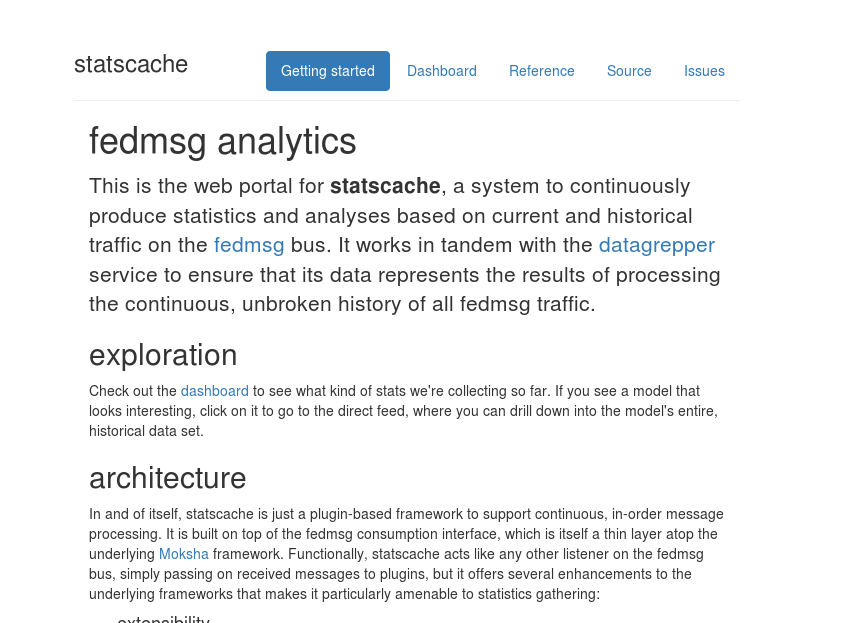
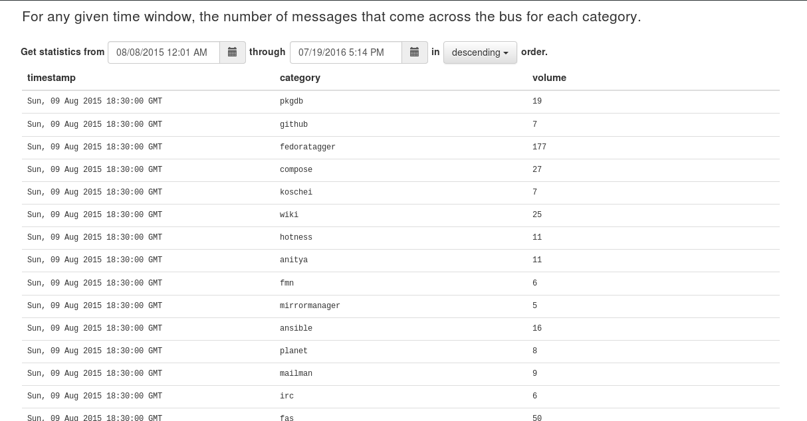

Tags: fedora,gsoc,python
Title: Understanding the statscache daemon
Date: 2016-07-17 11:17:00
Slug: understanding-the-statscache-daemon
Cover: https://communityblog.fedoraproject.org/wp-content/uploads/2016/03/gsoc-announce-1.png
Category: gsoc

The last two weeks were pretty hectic. I had to read up a lot of documentation, code, fight spam and recover from a failed Fedora Upgrade. Phew, glad to have myself finally back up.

To start with, I was working on the stats tool very less this month and was concentrating more on the new things I have on list. If you had been following my GSoC Posts, you would probably know that I have been working on a statistics tool for the Summer Interns. During the last CommOps meeting, we had a crazy idea - **Scaling the tool for an entire group/team and later for the community stats**. That really sounds ambitious and it is. The tool currently uses [datagrepper](https://apps.fedoraproject.org/datagrepper/) from which HTTP requests can be made to retrieve historic fedmsg data. This method worked fine for the interns as the weekly/monthly data of each of them did not cross 10 pages. However, it will be really slow to pull data of more than, say 50 people from statscache (especially of those who have been doing a lot on [koji](https://koji.fedoraproject.org/) and [copr](https://copr.fedorainfracloud.org/))

To solve this issue, [statscache](https://github.com/fedora-infra/statscache) was built. Statscache is a daemon to build and keep fedmsg statistics. It basically listens to the fedmsg hub waiting for messages. As soon as it encounters a message, it is passed onto the plugins which evaluates the topic and stores the statistics and the relevant parts of the `raw_message` locally. For statscache to function as intended, it requires the [statscache-plugins](https://github.com/fedora-infra/statscache_plugins). It is the plugins that does all the hard work of maintaining statistics. You could say statscache and statscache-plugins are made for each other :)

Deploying statscache locally is fairly simple. As simple as :
`$ git clone https://github.com/fedora-infra/statscache; cd statscache
$ python setup.py develop`

And plugins like :
`$ git clone https://github.com/fedora-infra/statscache_plugins; cd statscache_plugins
$ python setup.py develop`

After this is done, we need to gather the fedmsg messages. To do that, we will run `fedmsg-hub` in the main statscache repo.*(To install fedmsg-hub, you need to do `sudo dnf install fedmsg-hub`.)* You can stop `fedsmg-hub` anytime and statscache will have the statistics of all data you gathered before you exited.  After this is done, the web Flask server can easily be started by running `python statscache/app.py`. This should fire up the web front-end on http://localhost:5000. If everything was done correctly, something like this should be on your screen :

You can now head over to the dashboard and see the plugins in action.For instance, you can see the volume of data each category received using the volume-by-category plugins, which looks something like this:

This is often identified using the topic name of [fedmsg](https://fedora-fedmsg.readthedocs.io/en/latest/start.html). Every category of fedmsg has a unique topic name assigned to it. For example, if someone opens a new issue on [Pagure](https://pagure.io), the topic will be `org.fedoraproject.prod.pagure.issue.new` where `org.fedoraproject.prod` is common to all the fedmsg topics, whereas `pagure` says that the interaction was made on Pagure and the rest is self explanatory. You can see all the topics [here](https://fedora-fedmsg.readthedocs.io/en/latest/topics.html).

Now, I am currently working on devising a way to auto-generate statistics of all users of a FAS group. I'll make a new post as soon as I make progress here. Till then, Happy Hacking to me :)
