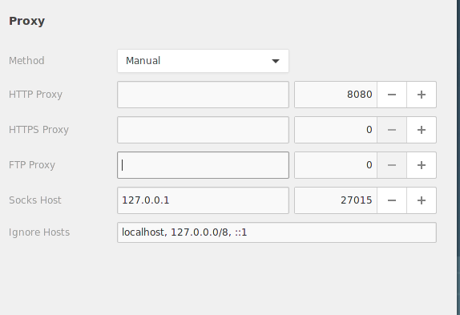

Tags: foss,ssh,networking
Title: Wrapping your head around SSH tunnels
Cover: images/82485.jpg
Summary: Understanding SSH tunnels and real-time examples.
Date: 2017-02-17 14:13:01
Slug: wrapping-your-head-around-ssh-tunnels
Category: security

> This post is for educational purposes only. VPN's might be illegal in some countries. If you are not sure of the consequences of tunnelling over a network/using a VPN, please do not attempt to do so. You have been warned.

*This is my first post in the Tunnelling and OpenVPN series. More coming up soon :)*

It's been really long since I blogged so here goes a pretty long-ish detailed blog about SSH tunnels. I have been playing around with VPN's for quite some time now and have learned a lot about networking, tunnelling and other **awesome** things about creating stable networks. [OpenVPN](https://openvpn.net/) is a free and open source application that implement s the features of a Virtual Private Network (**VPN**) to create a point-to-point secure connection. You can check out the features of OpenVPN [here](https://openvpn.net/index.php/open-source/333-what-is-openvpn.html). The possibilities and endless with OpenVPN. Using it, you can build everything ranging from a simple proxy server to a completely anonymous and secure Private network of people.

I started digging into the features of OpenVPN when my university started tightening the campus network by only allowing traffic through port 80 and 443. (Yes! 22 was blocked). Initially, I thought it was the end of git over SSH until I found out I could SSH over the HTTPS port on Github. Take a look at the article [here](https://help.github.com/articles/using-ssh-over-the-https-port/).

Before we get carried away, let's get back to VPN talk. One of the solutions to "port blocks" is SSH tunnelling.

> "If we see light at the end of the tunnel, it is the light of the oncoming train" ~ Robert Lowell.

SSH tunnelling, also known as "Poor Man's VPN", is a very powerful feature of SSH which creates a secure connection between a local computer and a remote machine through which services can be relayed.

Let us try to understand SSH tunnelling first. Creating an SSH tunnel is simple. Let us assume `Mr. FooMan` has a cloud server in Singapore with SSH daemon running on port 22 (the default port) and he wants to redirect all this traffic via the tunnel and not directly. Now, all he will do is ssh into his box using the `-D` directive:

`ssh -D 27015 fooman@hissingaporeserver.com -p 22`

Quoting the man page of SSH:

>-D [bind_address:]port

>Specifies a local “dynamic” application-level port forwarding. This works by allocating a socket to listen to port on the local side, optionally bound to the specified bind_address. Whenever a connection is made to this port, the connection is forwarded over the secure channel, and the application protocol is then used to determine where to connect to from the remote machine. Currently the SOCKS4 and SOCKS5 protocols are supported, and ssh will act as a SOCKS server. Only root can forward privileged ports. Dynamic port forwardings can also be specified in the configuration file.

As always, if you need to use a port below 1000, you can but you will have to be root. To verify this, go ahead and run a `netstat -tlpn` on the local machine. If everything goes well, you should see something like this:

 *Fig 1 : Port 27015 being used by the SSH process* 

This means that the SSH process is now listening on port 27015 for any connections. You can now use this port for redirecting all your browser traffic or set it as a SOCKS proxy on any application that supports proxified traffic.

Let us set a system-wide proxy on Linux. For this, fire up `Network Settings`, select Proxy and choose the method as `Manual`. Now set the **SOCKS** proxy to be localhost and the port as 27015 (or the port that followed your -D directive).

Once you are done, check your IP address. Viola! You have successfully proxified your entire system. Make sure you disable proxy when you are done using it or you won't be able to access the internet.

You can also configure just your Web Browser to use the proxy. I use [FoxyProxy](https://getfoxyproxy.org/downloads/) to achieve this. The configuration is pretty much the same except it acts as a plugin for your browser.

There are a lot of limitations in this case. SSH tunnelling will only work if your university/office allows outgoing traffic on 22 *(most probably blocked in most universities)*. If that is the case, you will have to take extra steps to work around the block.

I will be covering about OpenVPN in my upcoming posts. So, stay tuned! If you've anything in your mind and want to share, do drop a comment below :)
